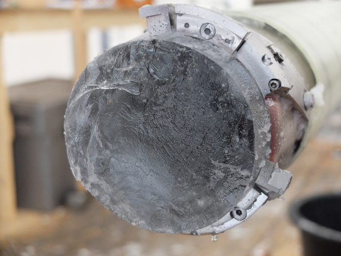
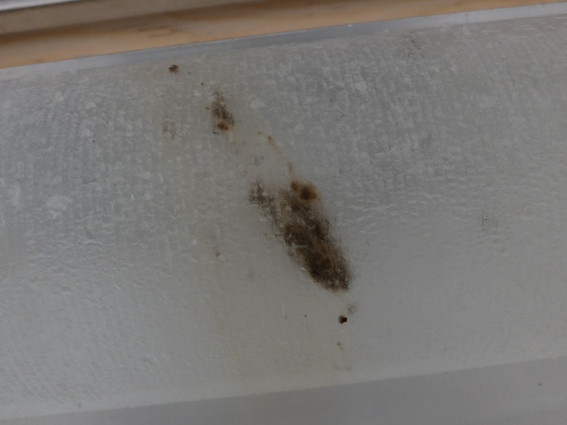
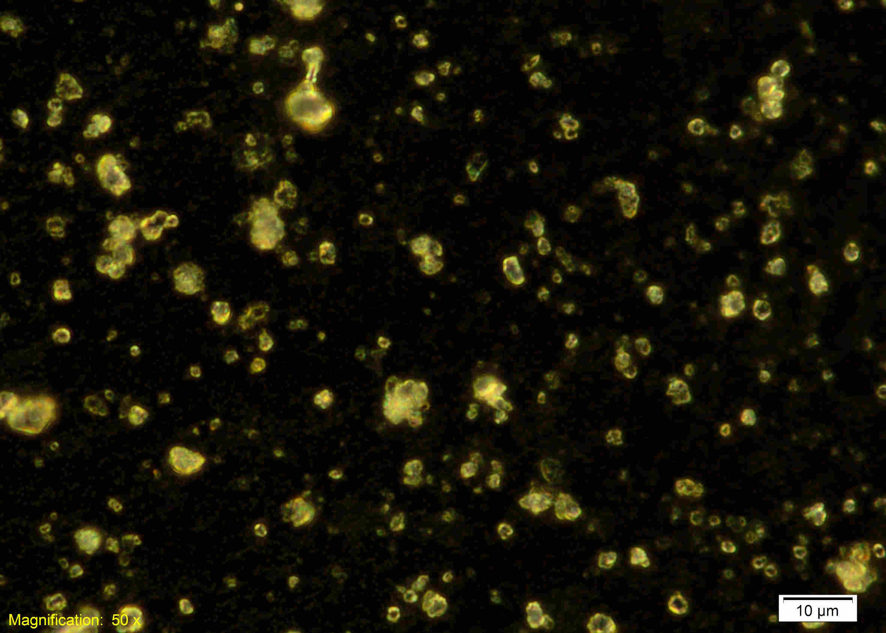
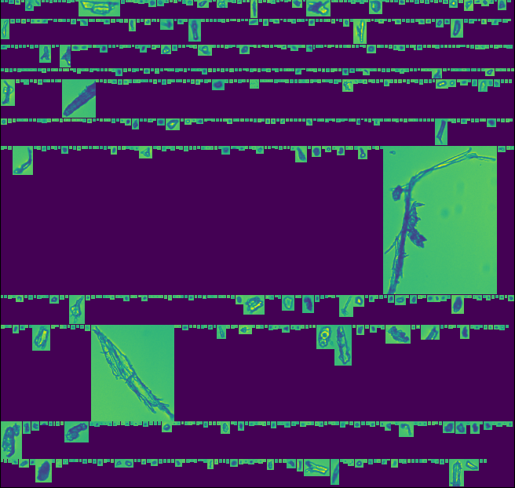
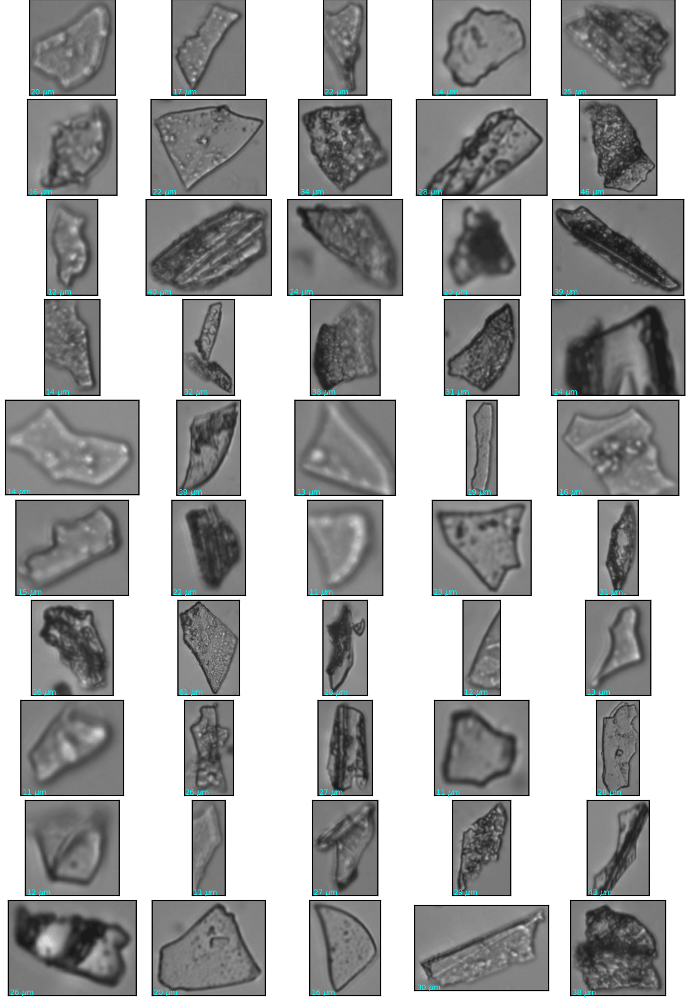
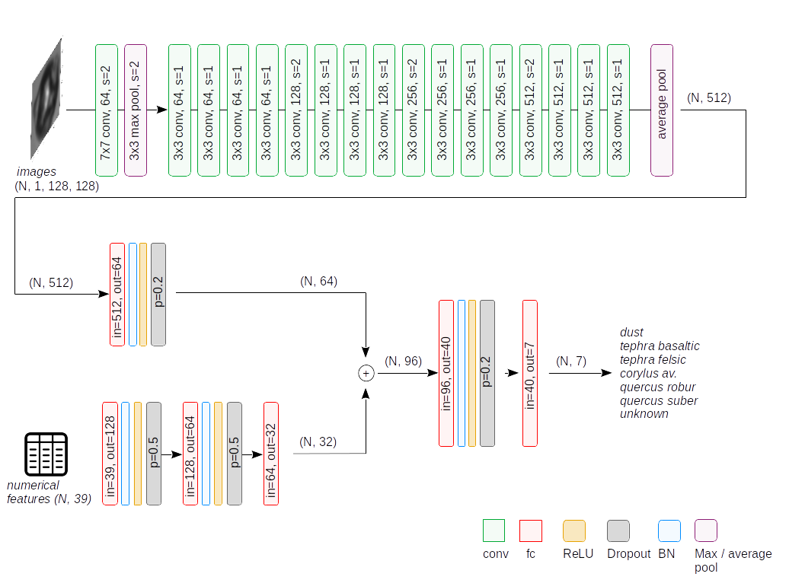
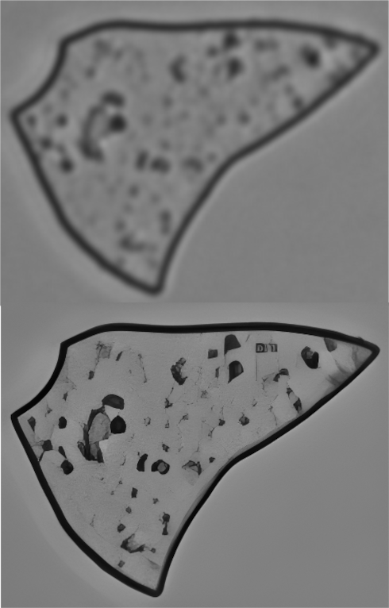

## Ice cores, a history book of past climate

Ice cores are long cylinders of ice that are drilled and extracted from polar ice sheets, Greenland and Antarctica, or from alpine glaciers. They serve as one of the most pristine records of past climate. Subsequent depositions of snow layers create a succession of climate snapshots that can be traced back to the last 800,000 years. The Earth's climate can be revealed by measuring impurities that are fixed inside the ice matrix: they are found in terms of soluble chemical compounds, atmospheric gasses trapped as tiny gas bubbles and insoluble particles, emitted from different sources such as deserts, forests and volcanoes, transported to the ice core site and thereby deposited and buried. The ICELEARNING project targets this latter class of impurities, insoluble particles, and specifically mineral dust from desert regions, volcanic ash emitted during volcanic eruptions and pollen species sourced from vegetated regions.

<div style="display: flex; gap: 10px; justify-content: space-between; flex-wrap: wrap;">
  <div style="flex: 1; min-width: 250px;">
    
    <p style="text-align: justify; font-size: 0.9em; color: #666; margin-top: 5px;">Renland Ice Core (Greenland, 
71.30° N, 26.72° W, 2350 m a.s.l). Credits: N. Maffezzoli</p>
  </div>
  <div style="flex: 1; min-width: 250px;">
    
    <p style="text-align: justify; font-size: 0.9em; color: #666; margin-top: 5px;">A visible layer of unknown particles 
in the core stratigraphy. Can ML help identifying the types of particles ? Credits: N. Maffezzoli</p>
  </div>
</div>

## Flow Imaging Microscopy
Flow Imaging Microscopy, or FIM, is a technique that can be used to have a direct look at the particles that 
are trapped in an ice core. All is needed is to melt the ice sample and inject it inside a flow cell, where a sensor
acquires photos, that can be saved and processed.

<div style="width: 100%; margin: 0 auto;">
  
  <p style="text-align: center; font-size: 0.9em; color: #666; margin-top: 5px;">
    Mineral dust particles visible from a FIM devide. Credits: N. Maffezzoli.
  </p>
</div>

In an ice core we can observe a very wide spectrum of particles. Depending on the ice core site, you may even encounter
marine diatoms, uplifted by the wind from the sea surface and transported over the ice. We need a way to efficiently 
detect and classify these particles, unless we want to do it manually (very time-consuming).

<div style="width: 100%; margin: 0 auto;">
  
  <p style="text-align: center; font-size: 0.9em; color: #666; margin-top: 5px;">
    Particles visible using a FlowCam FIM instrument. Credits: N. Maffezzoli.
  </p>
</div>

## Image classification and Super Resolution via deep neural networks
One way to classify images of ice core particles is to use Convolutional Neural Networks.
I created training datasets for different types of particles and trained a hybrid **Multi Layer Perceptron - Convolutional
Neural Network** (MLP-CNN) system for image classification. The most time-consuming activity is, as always, building the 
training dataset.

<div style="width: 100%; margin: 0 auto;">
  
  <p style="text-align: center; font-size: 0.9em; color: #666; margin-top: 5px;">
    Training dataset. This class of particles consists of felsic volcanic tephra. Credits: N. Maffezzoli.
  </p>
</div>

The architecture is trained to classify 7 classes of particles: mineral dust, basaltic and felsic tephra,
3 types of pollen (_corylus avellana_, _quercus robur_ and _quercus suber_), and an everything-else-spurious class.

<div style="width: 100%; margin: 0 auto;">
  
  <p style="text-align: center; font-size: 0.9em; color: #666; margin-top: 5px;">
    Hybrid MLP-CNN architecture for image classification. Credits: N. Maffezzoli.
  </p>
</div>

A side project related to the main image classification task was trying to increase the resolution of the images.
This is known in computer-vision as a "**Super Resolution**" exercise. As often happens, neural networks are now the state-of-the-art for
this type of quest. I trained a model and increased the resolution of the images, as in the example below. Then I 
used the high-resolution images to train the image classification network, hoping for an increased performance. The result ?
It did not improve, but at least I tried :)

<div style="width: 100%; margin: 0 auto;">
  
  <p style="text-align: justify; font-size: 0.9em; color: #666; margin-top: 5px;">
    Super Resolution network in action in increasing 20x the resolution of a volcanic tephra image. Credits: N. Maffezzoli.
  </p>
</div>

---

##### Citation

The work has been published in The Cryosphere:

Maffezzoli, N., Cook, E., van der Bilt, et al.: Detection of ice core particles via deep neural networks, 
The Cryosphere, 17, 539–565, https://doi.org/10.5194/tc-17-539-2023, 2023.

```latex
@article{maffezzoli2023,
author = {Maffezzoli, N. and Cook, E. and van der Bilt, W. G. M. and St{\o}ren, E. N. and Festi, D. and Muthreich, F. and Seddon, A. W. R. and Burgay, F. and Baccolo, G. and Mygind, A. R. F. and Petersen, T. and Spolaor, A. and Vascon, S. and Pelillo, M. and Ferretti, P. and dos Reis, R. S. and Sim\~oes, J. C. and Ronen, Y. and Delmonte, B. and Viccaro, M. and Steffensen, J. P. and Dahl-Jensen, D. and Nisancioglu, K. H. and Barbante, C.},
title = {Detection of ice core particles via deep neural networks},
journal = {The Cryosphere},
volume = {17},
year = {2023},
number = {2},
pages = {539--565},
url = {https://tc.copernicus.org/articles/17/539/2023/},
doi = {10.5194/tc-17-539-2023}
}
```
---

##### Funding
The ICELEARNING project has received funding from the European Union's Horizon H2020 research and innovation programme 
under the **Marie Skłodowska-Curie grant** agreement no. 845115.

<div style="display: flex; gap: 20px; justify-content: space-between; align-items: center; flex-wrap: wrap;">
  <div style="flex: 1; min-width: 100px; max-width: 150px;">
    
  </div>
  <div style="flex: 1; min-width: 100px; max-width: 150px;">
    
  </div>
  <div style="flex: 1; min-width: 100px; max-width: 180px;">
    
  </div>
</div>