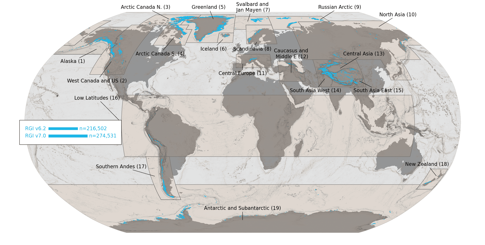
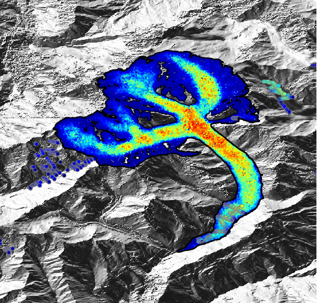
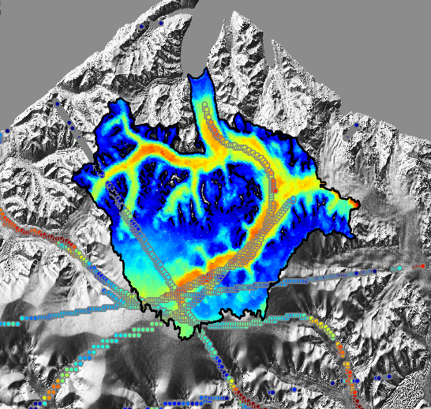
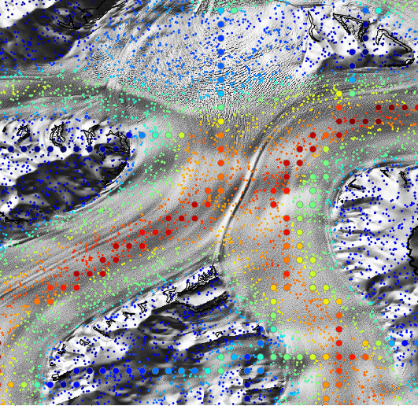
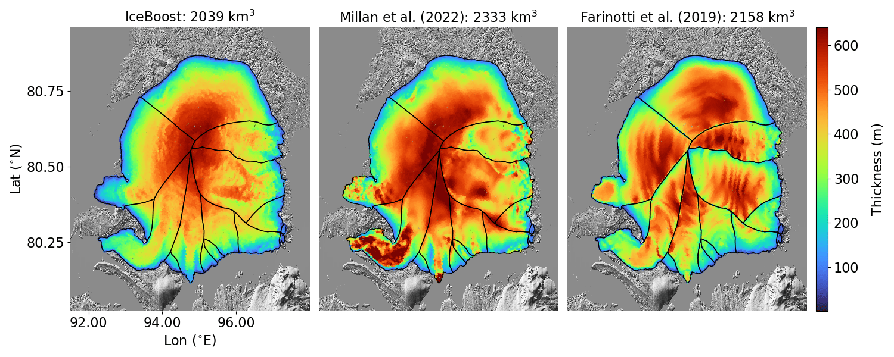

### Glaciers and their thickness
Knowledge of the volumes of glaciers and ice caps, as well as their spatially distributed ice thickness, is fundamental 
for geophysical modeling. As of today, we know their volumes (and their distributed ice thickness) with a large
degree of uncertainty, especially where we have absent or little direct measurements (the Himalayas, a notable example).
Since we cannot measure glacier thickness everywhere, we rely on models to estimate their present-day conditions.
**Importantly, glacier future projections are strongly dependent (that is pretty obvious) on today's volumes. If those
are not uncertain, so will be their future projections at 2100.**

<div style="width: 100%; margin: 0 auto;">
  
  <p style="text-align: center; font-size: 0.9em; color: #666; margin-top: 5px;">
    All existing glaciers from the Randolph Glacier Inventory. Credits: N. Maffezzoli.
  </p>
</div>

In this project, the goal is to improve the knowledge of glacier ice volumes. The 
approach I decided to pursue is to develop a machine learning model. The reasoning behind this choice is to leverage
the millions of available ice thickness measurements that have been acquired over decades of field campaigns all over 
the world's glaciers. Such an approach, on a global scale, has not been attempted before.

### Machine learning regression

Some decades ago, scientists have started to monitor glaciers. First, by taking photographs. 
Later on, measurements became possible. Now, we have millions of thickness data available from hundreds-to-thousands 
glaciers scattered around the world. That sounds a lot, but it is not, as only about 1% of glaciers provide data. 
A machine learning approach can leverage such data to provide us with an estimate of ice thickness, based on a set of 
other variables related to ice thickness. Different architectures exist for such a regression. 
I explored three of them: Multi-layer perceptron (a great classic), Gradient-Boosted Decision Trees (great for sparse 
data, blazing fast), and Graph Neural Networks (a great way to leverage any geometrical structure of the system).

Below some results at inference time ⬇️
<div style="display: flex; gap: 15px; justify-content: space-between; flex-wrap: wrap; width: 100%;">
  <div style="flex: 1; min-width: 200px;">
    
  </div>
  <div style="flex: 1; min-width: 200px;">
    
  </div>
  <div style="flex: 1; min-width: 200px;">
    
  </div>
</div>
<p style="text-align: justify; font-size: 0.9em; color: #666; margin-top: 8px;">
  Modeled ice thickness via a Multi-Layer Perceptron (left, <a href="https://www.google.com/maps/place/Aletsch+Glacier/@46.4887025,8.0530777,15z/data=!3m1!4b1!4m6!3m5!1s0x478f706358ba0c6b:0x814ab15289527d53!8m2!3d46.4887031!4d8.0530777!16zL20vMDFwcnZ6?entry=ttu&g_ep=EgoyMDI0MTIxMS4wIKXMDSoASAFQAw%3D%3D" target="_blank">Aletsch glacier</a>, Swiss Alps), 
a Gradient-Boosted Decision Tree (middle, <a href="https://www.google.com/maps/place/69%C2%B042'00.0%22N+27%C2%B000'00.0%22W/@69.7303722,-27.4597467,147478m/data=!3m1!1e3!4m4!3m3!8m2!3d69.7!4d-27?authuser=0&entry=ttu&g_ep=EgoyMDI0MTIxMS4wIKXMDSoASAFQAw%3D%3D" target="_blank">69.7 N, 27.0 W</a>), 
a Graph Neural Network (right, <a href="https://www.google.com/maps/@70.1041494,-25.4293756,9.47z?authuser=0&entry=ttu&g_ep=EgoyMDI0MTIxMS4wIKXMDSoASAFQAw%3D%3D" target="_blank">70.2 N, 25.2 W</a>). 
Measurements over these glaciers are indicated with the big circles. Credits: N. Maffezzoli.
</p>

After some consideration and weighting pros and cons, I decided to fully develop a gradient-boosted tree model, 
called ICEBOOST. It is informed by some 39 numberical features, and ensembles XGBoost and CatBoost for its prediction. 
It is developed on GitHub. 

<div style="width: 100%; margin: 0 auto;">
  
  <p style="text-align: justify; font-size: 0.9em; color: #666; margin-top: 5px;">
   <a href="https://en.wikipedia.org/wiki/Academy_of_Sciences_Glacier" target="_blank">Academy of Sciences ice cap</a> 
(Komsomolets Island, Severnaya Zemlya, Russian Federation) modeled ice thickness. 
Left: ICEBOOST (gradient-boosted system), middle: Shallow Ice Approximation by <a href="https://www.nature.com/articles/s41561-021-00885-z" target="_blank">Millan et al., 2022</a>, right: model 
by <a href="https://www.nature.com/articles/s41561-019-0300-3" target="_blank">Farinotti et al. (2019)</a>. No ground truth data is available this ice cap to compare the three models. 
Credits: N. Maffezzoli.
  </p>
</div>

---
### Datasets and released Products
We released the following products:
- Global paper, preprint on arXiv: https://arxiv.org/abs/2512.11685
- Global paper: in-press in Nature Scientific Data - hang in there ..
- Zenodo (model, modeled glaciers, training datasets): https://zenodo.org/records/17724512
- Zenodo (glacier regional merged mosaics): https://zenodo.org/records/20463551
- Zenodo (glacier-complex products): https://zenodo.org/records/21220985
- Web Visualizer: https://nmaffe.github.io/iceboost_webapp/

---

##### Citation

The model was published on Geoscientific Model Development:

Maffezzoli, N., Rignot, E., Barbante, C., Petersen, T., and Vascon, S.: A gradient-boosted tree framework to model the 
ice thickness of the world's glaciers (IceBoost v1.1), Geosci. Model Dev., 18, 2545–2568, 
https://doi.org/10.5194/gmd-18-2545-2025, 2025.

```latex
@Article{maffezzoli_iceboost_2025,
author = {Maffezzoli, N. and Rignot, E. and Barbante, C. and Petersen, T. and Vascon, S.},
title = {A gradient-boosted tree framework to model the ice thickness of the world's glaciers (IceBoost v1.1)},
journal = {Geoscientific Model Development},
volume = {18},
year = {2025},
number = {9},
pages = {2545--2568},
url = {https://gmd.copernicus.org/articles/18/2545/2025/},
doi = {10.5194/gmd-18-2545-2025}
}
```
---

##### Funding
The work has been supported by the EU Horizon Europe **Marie Sklodowska-Curie Actions** programme (Grant no. 101066651), 
project SKYNET.

<div style="display: flex; gap: 20px; justify-content: space-between; align-items: center; width: 100%; margin: 20px 0;">
  <div style="flex: 1; display: flex; justify-content: center;">
    
  </div>
  <div style="flex: 1; display: flex; justify-content: center;">
    
  </div>
  <div style="flex: 1; display: flex; justify-content: center;">
    
  </div>
</div>